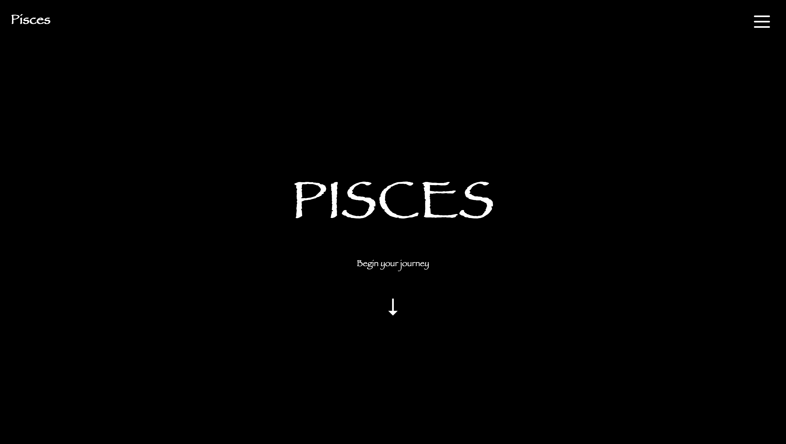
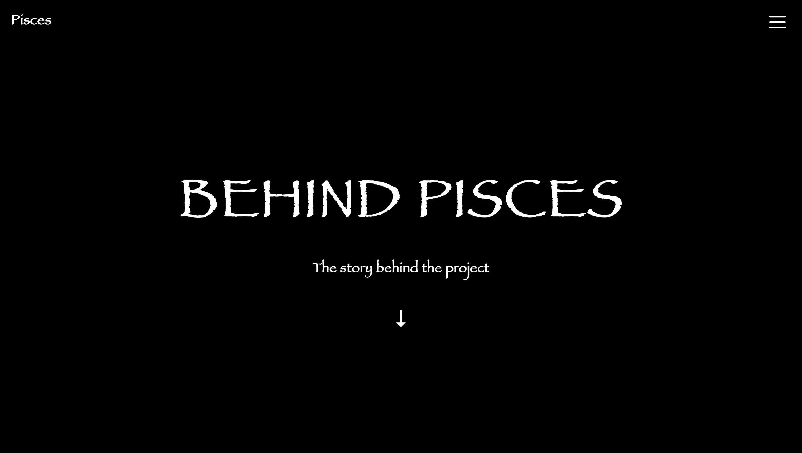
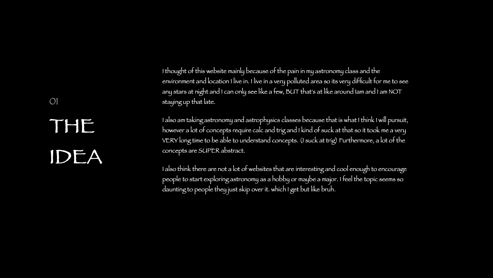
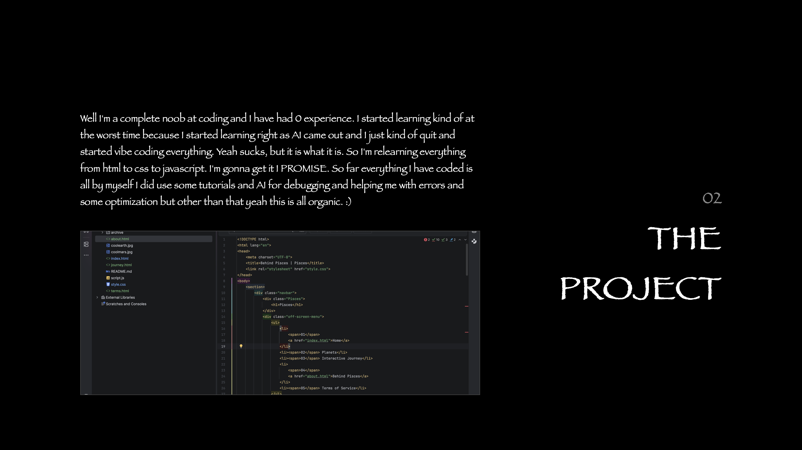
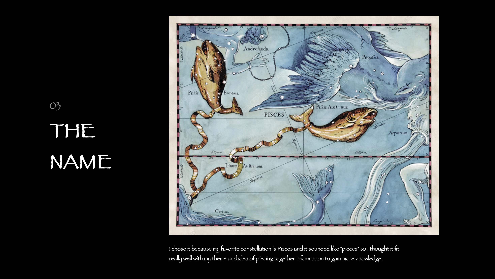

# Pisces is a interactive astronomy website I made to make learning and exploring astronomy more interesting and visual. 

## Why?
I thought of this website mainly because of the pain in my astronomy class and the environment and location I live in. I live in a very polluted area so its very difficult for me to see any stars at night and I can only see like a few, BUT that's at like around 1am and I am NOT staying up that late. I also am taking astronomy and astrophysics classes because that is what I think I will pursuit, however a lot of concepts require calc and trig and I kind of suck at that so it took me a very VERY long time to be able to understand concepts. (I suck at trig) Furthermore, a lot of the concepts are SUPER abstract. I also think there are not a lot of websites that are interesting and cool enough to encourage people to start exploring astronomy as a hobby or maybe a major. I feel the topic seems so daunting to people they just skip over it. which I get but like bruh.

## How? 
Well I'm a complete noob at coding and I have had 0 experience. I started learning kind of
at the worst time because I started learning right as AI came out and I just kind of quit
and started vibe coding everything. Yeah sucks, but it is what it is. So I'm relearning everything
from html to css to javascript. I'm gonna get it I PROMISE. So far everything I have coded is all by myself
I did use some tutorials and AI for debugging and helping me with errors and some optimization but other than that
yeah this is all organic. :)
## My goals
- Cool entrance
- Interactive planets
- Interactive Journey
- Planet cards
- Math and Physics interactive thing
- Live connection to NASA telescope pictures. (With frequent updates or automatic)
- Add more trig and geometry based simulations and interactives so you can understand things more easily.
- Add links to other sources that are cool and useful.

## Why the name Pisces?
I chose it because my favorite constellation is Pisces and it sounded like "pieces" so I thought it fit really well with my theme and idea of piecing together information to gain more knowledge.

## Credits:
I used some AI for debugging and figuring out how to fix some bugs. I also used it to help me optimize some sections of my code. 

## About Me:
PISCES was created by...ME, a 15 year old in a pretty prestigous highschool. (Don't wanna brag)
I suck at coding, I'm asian, tall, like reading, using AI for stupid stuff, investing, photography,
and idk other cool things. I'm also kinda shy hehe but once you get to know me I bet we will have fun. :)

